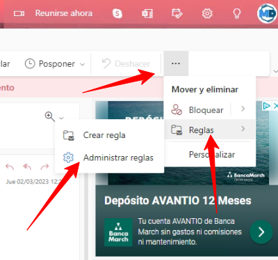
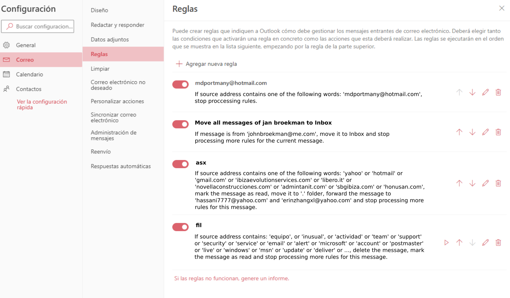

# Exercise 25

  The following [email](https://github.com/LoloGRK/TeelTechCyberSecurity/blob/a72249d74b3d2c34b5842a48a5237058b21524ef/exercises_025/email_002.eml) has been received and the customer has sent the money. The money has never been received.
  
  Investigate it!
    
  <details>
  <summary>Solution</summary>
  
  1. Open the email with a text editor.
  2. Previsualize it
  
     It's about a bank transfer to a new account.
  
  3. Get hops

     | Date | Event | Server |
     |------|-------|--------|
     | Wed, 15 Feb 2023 08:52:20 +0000 | Email was written | - |
     | 15 Feb 2023 08:52:20.9732 | Out for delivery | AM0PR10MB3249.EURPRD10.PROD.OUTLOOK.COM |
     | Wed, 15 Feb 2023 08:52:21 +0000 | Received by | DB4PR10MB6118.EURPRD10.PROD.OUTLOOK.COM |
     | - | Received by | EUR05-VI1-obe.outbound.protection.outlook.com |
     | Wed, 15 Feb 2023 09:52:22 +0100 (CET) | Received by | llsb006-a16.servidoresdns.net |
     | Wed, 15 Feb 2023 09:52:24 +0100 (CET) | Received by | lp-mail-smtp-filter-in-a-11.correo.lan |
     | Wed, 15 Feb 2023 09:52:24 +0100 (CET) | Received by | llsb006-a16.servidoresdns.net |
     | Wed, 15 Feb 2023 09:52:24 +0100 | Delivered | llcm214-z.correo.lan |

     
         
  4. Get Important headers
     
     | Header | Value |
     |--------|-------|
     | Received-SPF | pass (hotmail.com: Sender is authorized to use 'mdportmany@hotmail.com' in 'mfrom' identity (mechanism 'include:spf.protection.outlook.com' matched)) receiver=llsb006-a16.servidoresdns.net; identity=mailfrom; envelope-from="mdportmany@hotmail.com"; helo=EUR05-VI1-obe.outbound.protection.outlook.com; client-ip=40.92.90.45 |
     
  5. Get client-IP information
     
     ```
     {
       "input": "40.92.90.45",
       "data": {
         "ip": "40.92.90.45",
         "hostname": "mail-vi1eur05olkn2045.outbound.protection.outlook.com",
         "city": "Vienna",
         "region": "Vienna",
         "country": "AT",
         "loc": "48.2085,16.3721",
         "org": "AS8075 Microsoft Corporation",
         "postal": "1010",
         "timezone": "Europe/Vienna",
         "asn": {
           "asn": "AS8075",
           "name": "Microsoft Corporation",
           "domain": "microsoft.com",
           "route": "40.80.0.0/12",
           "type": "business"
         },
         "company": {
           "name": "Microsoft Corporation",
           "domain": "microsoft.com",
           "type": "business"
         },
         "privacy": {
           "vpn": false,
           "proxy": false,
           "tor": false,
           "relay": false,
           "hosting": false,
           "service": ""
         },
         "abuse": {
           "address": "US, WA, Redmond, One Microsoft Way, 98052",
           "country": "US",
           "email": "abuse@microsoft.com",
           "name": "Microsoft Abuse Contact",
           "network": "40.74.0.0-40.125.127.255",
           "phone": "+1-425-882-8080"
         }
       }
     }
     ```
     
  6. Get Bank account information

      ```
      ES33 0073 0100 5107 7241 4892
      ```
      
      | Field | Value |
      |-------|-------|
      | Bank | OPEN BANK, S.A. (0073) |
      | BIC/SWIFT entity | OPENESMMXXX |
      | Branch | 0100 - PZA.MANUEL GOMEZ MORENO, 2,28020 MADRID |
      | Phone | 913421000 |

  </details>    

Questions:

- Is there any account/domain compromised?
- What actions would you perform?

<details>
<summary>Actions</summary>

- Ask for a warrant to request for OPEN BANK, S.A. to provide information about the owner of the account #ES33 0073 0100 5107 7241 4892

- Ask for a warrant to request for OPEN BANK, S.A. to provide information about the all the login data of the account #ES33 0073 0100 5107 7241 4892 looking for something unusual:

   - IPs from other regions or countries
   - Different user-agents
   - Different time zones

- If it's a proxy/VPN

   - Formerly ask the provider to provide all the information they have, including login data, address, ips... for this IP in the specific time interval they logged into the online banking service

   - Repeat until No-Proxy/No-VPN

- Once you have a residential IP, ask the ISP for the owner's information 

- This email looks legit, what could have happened?

   - Can someone be lying?

- We ask the receiver to give us access to the account
   - Check email rules

      
    
   - Full rule list
    
      
    
 
- Rule *translation*
   1. If the message is from the same user who the account belongs to, stop processing it:
   
      This is useful if the user is trying to check some strange behaviour in email, don't do anything.
   
   2. If the message is from *johnbroekman@me.com*, don't do anything:

      Maybe this is one of the scammer's addresses which might be used for testing purposes.
   
   3. If the source address contains one of the following words *yahoo, hotmail, gmail.com, ibizaevolutionservices.com, libero.it, novellaconstrucciones.com, admintanit.com, sbgibiza.com, honusan.com*, mark the messeage as read and forward the message to *hassani777@yahoo.com and erinzhangxl@yahoo.com* and stop processing more rules.

      This rule states that the scammer knows the target's customers and who may pay some bill. This way, any email sent from any of this accounts will be set as read, kept and forwarded to the scammer to process it.
      
      Now the scammer has the links of the organization to his providers:
      
      - ibizaevolutionservices.com: Administrative and Support Service Activities
      - novellaconstrucciones.com: Construction company
      - admintanit.com: Accountant services
      - sbgibiza.com: Accountant services
      - honusan.com: Construction company
      
      This way, the scammer can control wether any message from their main providers is received and it will be marked as read and forwarded to the scammer to check if it's valuable.
      
   4. If source address contains *equipo, inusuao, actividad, team, support, security, service, email, alert, microsoft, account, postmaster, live, windows, msn, update, deliver* or many other words, delete the message, mark it as read and stop processing more rules. 
      
      This way, if the users asks for support to the provider or even Microsoft, the message will be deleted, making sure the scammer, that he will not receive any help.
  

*Conclusions:*

The hacker got access to the user's account and had full control over it.

With access to the account or to the server, emails can be modified by using low level protocols knowledge


</details>

