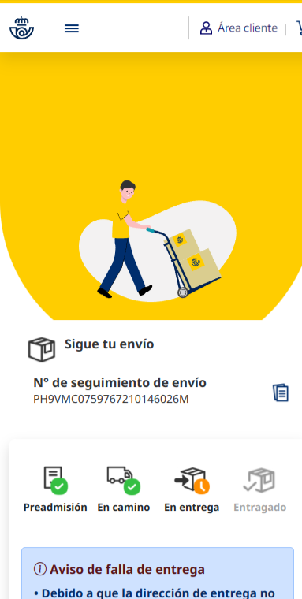
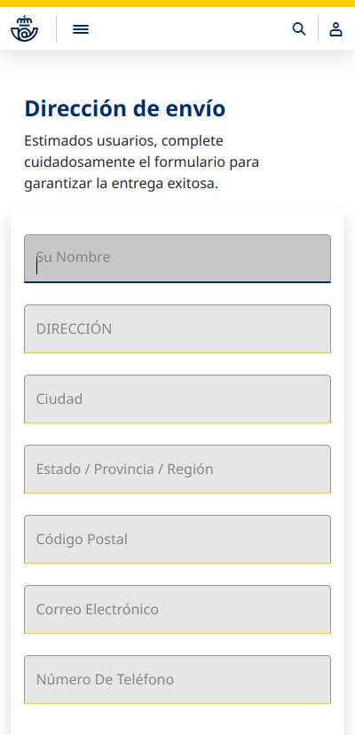
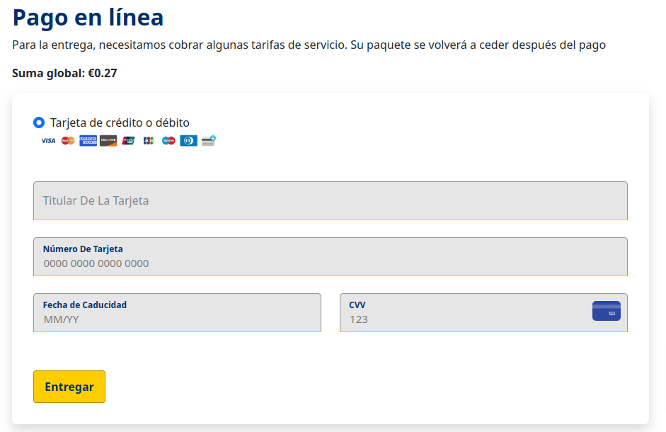
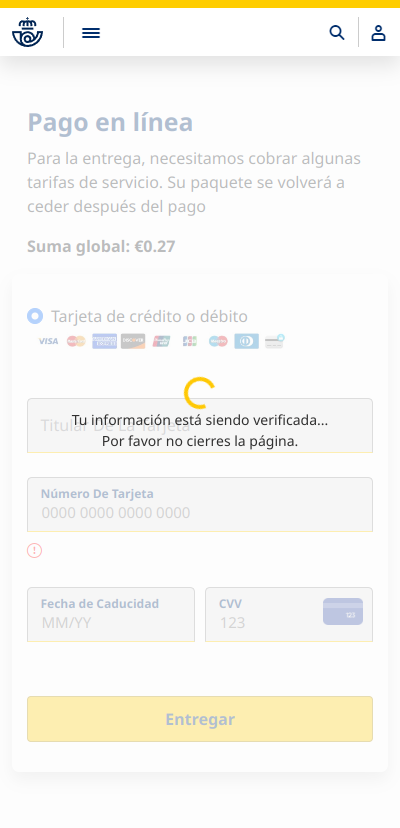

# Exercise 30

The following SMS has been received.

It seems suspicious.

```
(Freight Center) We've tried to deliver your parcel more than one time, please confirm your delivery address or your parcel will be shipped back: https://wiki.grksystems.com/piscinas/web.html
```

<details>
<summary>Solution</summary>

1. Analyze URL

   itsssl.com/correospost
   
   If you open it from your laptop browser, you'll get an arabic website, but it's not the website that the user landed.
   
   Switch your browser to behave like a smartphone or tablet and refresh the website and keep the Developer Tools - Network tab open.
   
   
   
   
   
   
   
   Before submitting the form, clear the network tab, so your first request will be the one from the from.
   
   
   
   Once you fill the forms and send the "Deliver" button. Check the content and all the data has been sent to the following url http://srv223049.hoster-test.ru/cas/corr/infos.php

2. As it's a legit site which seems to be hacked, request for server logs to investigate them to check when was this file uploaded and try to get more information.

</details>
