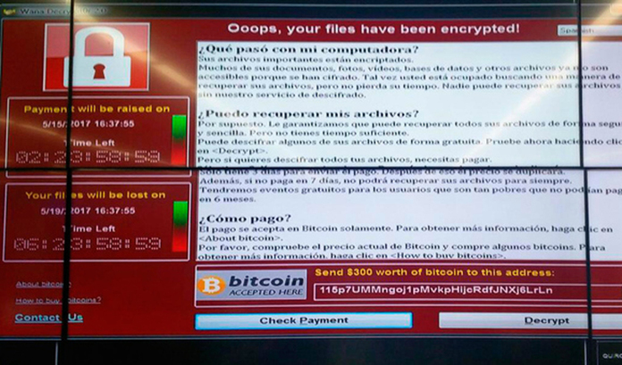

# Exercise 38

A company has been seized with a malware and this is the message they are getting on screen:

By using the blockchain, try to check the balance of the group.

Hint: You can use [www.blockchain.com](https://www.blockchain.com/es/explorer) or [https://blockstream.info/](https://blockstream.info/)

Example Address: 115p7UMMngoj1pMvkpHijcRdfJNXj6LrLn
